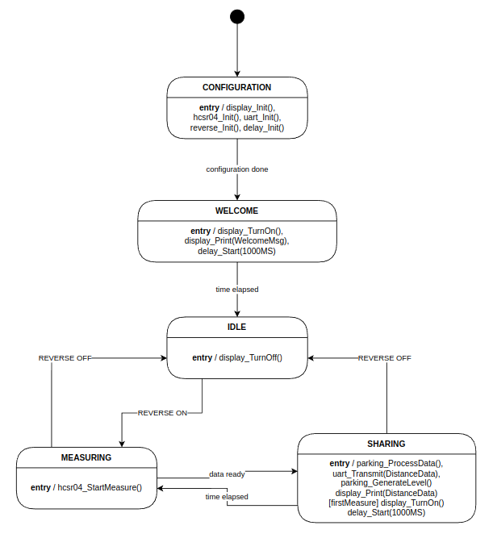
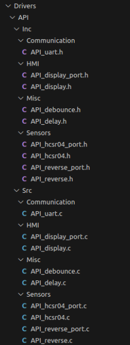

# Sensor de estacionamiento - TP Final

## Presentacion
- [Presentación PdM](docs/presentations/TP%20Final%20-%20Sensor%20de%20estacionamiento_PdM.pdf)
- [Presentación PCSE](docs/presentations/TP%20Final%20-%20Sensor%20de%20estacionamiento_PCSE.pdf)

## Video demostrativo
[Link al video demostrativo](https://drive.google.com/file/d/1kpjmVj-tzo7kiJs-pOcB94lYorYwudE8/view)

## Explicación

Se implementa un asistente de estacionamiento para autos como un PdC (park distance control) en la placa NUCLEO-F429ZI de ST. Para esto, se emplea un sensor ultrasónico (HC-SR04) para determinar la distancia al objeto más cercano. Esta información medida será procesada de acuerdo a una resolución preestablecida (9 niveles) para luego presentarse de forma entendible para el usuario en un display LED 16x2 (HD44780). El protocolo utilizado para la comunicación con el display será I2C, ya que este módulo utiliza como intermediario al PCF8564. Para la medición de los pulsos temporales leídos del pin ECHO del sensor ultrasónico se utiliza el periférico TIM (TimeBase). El inicio de la medición se controla mediante la escritura del GPIO que está conectado al pin TRIGGER del sensor. Los valores procesados serán también enviados por UART para ser utilizados de debugging. El programa tendrá un modo de bajo consumo en el que no se estará midiendo y el display estará apagado. Para que pase al modo de funcionamiento activo deberá estar en HIGH la señal que representa la marcha atrás o reversa. Esto se emula para el trabajo práctico mediante el pulso efectivo del botón de usuario que facilita la placa de desarrollo. 

El funcionamiento del programa se puede ver representado en la siguiente máquina de estados finitos:

Para hacer una correcta identificación de los pulsos del botón, se implementó un anti-rebotes por software que se representa con el siguiente diagrama:

Valor inicial:
- Estado inicial de la MEF: BUTTON_UP.

## Módulos

Se modularizó el código implementado siguiendo este esquema:

Se separó en módulos de acuerdo a funcionalidades comunes.
- Comunicación con el exterior (UART).
- Interfaz de usuario (Display).
- Herramientas y utilidades (debounce y delay no bloqueante).
- Sensado de señales externas (ultrasónico y reversa).

Los drivers del display, ultrasónico y reversa fueron planteados de forma genérica para no tener dependencias con el hardware. Se implementó una capa de aplicación y una capa de bajo nivel (port.c). En caso de querer portar algun driver de los mencionados, se deberá modificar los archivos port.

## Drivers desarrollados

Para este trabajo práctico se desarrolló la comunicación con periféricos mediante la utilización de 3 protocolos: UART, I2C y uno propio del fabricante del sensor ultrasónico.

### Driver de I2C

Este driver se realizó para el control del display mediante un intermediario que es el PCF8574. Este es un expander de 8 bits que recibe información por I2C y la expone de forma paralela sobre los pines del display.

El display es el HD44780 de 16x2 y está configurado en el modo 4 bits y 2 líneas. A este periférico se le debe mandar tramas de 8 bits compuestas por 4 bits de datos y 4 bits de características propias del display:
- Enable del backlight
- Enable escritura o lectura
- Acción de read o write
- Indicador de tipo de comando (control o data)

Este driver expone las siguientes funcionalidades:
- Encedido y apagado de display.
- Escritura en la linea superior o inferior del display.
- Limpieza de lo escrito en el display.

Este driver tiene una capa de aplicación y otra de bajo nivel. Esto se diferencia con los archivos de tipo port. Estos deben ser implementados de acuerdo al hardware en el cual se quiera correr el driver.

### Driver para el HCSR-04

Este driver se implementó con el módulo TIM (Timer) para medir los pulsos temporales leídos del pin de ECHO de la manera más exacta posible. Para esto se utiliza interrupciones que saltan en ambos flancos para tomar muestras de tiempos y así obtener el ancho del pulso. Cuando se quiere iniciar una medición, se escribe un 1 sobre el GPIO de TRIG por 10 us como recomienda la hoja de datos.

Cuando está la medición lista, se ejecuta un callback para reportar el valor leído. Este debe ser implementado por parte del desarrollador que utilice este driver.

Este driver tiene una capa de aplicación y otra de bajo nivel. Esto se diferencia con los archivos de tipo port. Estos deben ser implementados de acuerdo al hardware en el cual se quiera correr el driver.

### Driver de UART

Este driver se implementó para la comunicación por terminal serie. Se exponen funciones para transmitir y recibir datos en forma de cadenas.

Por el tamaño de este driver se consideró que no era necesario la separación entre módulo de aplicación y de bajo nivel. Si este driver llegara a crecer por implementación de mayor lógica, esto sería lo más adecuado.
