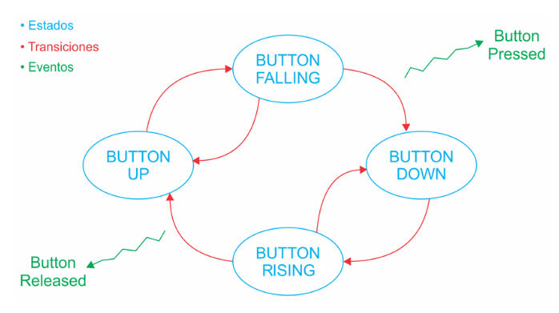

# Sensor de estacionamiento - TP Final

Se implementa un asistente de estacionamiento para autos como un PdC (park distance control) en la placa NUCLEO-F429ZI de ST. Para esto, se emplea un sensor ultrasónico (HC-SR04) para determinar la distancia al objeto más cercano. Esta información medida será procesada de acuerdo a una resolución preestablecida (9 niveles) para luego presentarse de forma entendible para el usuario en un display LED 16x2 (HD44780). El protocolo utilizado para la comunicación con el display será I2C, ya que este módulo utiliza como intermediario al PCF8564. Para la medición de los pulsos temporales leídos del pin ECHO del sensor ultrasónico se utiliza el periférico TIM (TimeBase). El inicio de la medición se controla mediante la escritura del GPIO que está conectado al pin TRIGGER del sensor. Los valores procesados serán también enviados por UART para ser utilizados de debugging. El programa tendrá un modo de bajo consumo en el que no se estará midiendo y el display estará apagado. Para que pase al modo de funcionamiento activo deberá estar en HIGH la señal que representa la marcha atrás o reversa. Esto se emula para el trabajo práctico mediante el pulso efectivo del botón de usuario que facilita la placa de desarrollo. 

El funcionamiento del programa se puede ver representado en la siguiente máquina de estados finitos:

Para hacer una correcta identificación de los pulsos del botón, se implementó un anti-rebotes por software que se representa con el siguiente diagrama:

Valor inicial:
- Estado inicial de la MEF: BUTTON_UP.

## Módulos

Se modularizó el código implementado siguiendo este esquema:

Se separó en módulos de acuerdo a funcionalidades comunes.
- Comunicación con el exterior (UART).
- Interfaz de usuario (Display).
- Herramientas y utilidades (debounce y delay no bloqueante).
- Sensado de señales externas (ultrasónico y reversa).

Los drivers del display, ultrasónico y reversa fueron planteados de forma genérica para no tener dependencias con el hardware. Se implementó una capa de aplicación y una capa de bajo nivel (port.c). En caso de querer portar algun driver de los mencionados, se deberá modificar los archivos port.
