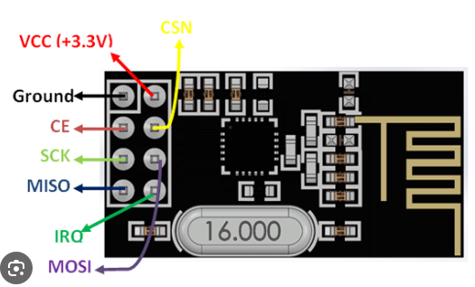

# Práctica 5 - UART

Este programa cambie el tiempo de parpadeo de un LED entre 100 ms y 500 ms cada vez que se presione un botón. Para esto, se implementa una MEF para evitar la detección de pulsos espurios del botón a partir de un anti-rebote por software. Cuando se confirma que el botón de usuario de la placa NUCLEO-F4 ha sido presionado (40 ms de anti-rebote), se cambia el tiempo de parpadeo del LED1 (LED verde) de usuario de 100 ms a 500 ms o viceversa.

La máquina de estados finitos (MEF) que se implementó para el anti-rebotes por software se representa con el siguiente diagrama:

Valores iniciales:
- Estado inicial de la MEF: BUTTON_UP.
- Tiempo inicial de parpadeo del LED1: 100 ms.

Además, este programa envía por puerto serie un mensaje indicando que el botón ha sido presionado o soltado. Esto se da cuando hay un flanco ascendente o descendente confirmado por el anti-rebote.

# Orden de cables
1. CE
2. SCK
3. MISO
4. CSN
5. MOSI
6. IRQ

