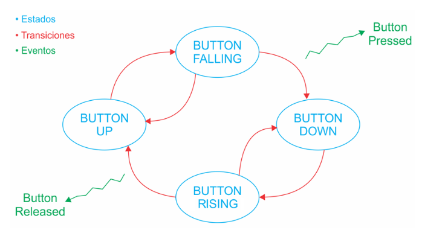

# Práctica 4 (Punto 1) - Debounce

Este programa implementa una MEF para evitar la detección de pulsos espurios de un botón a partir de un anti-rebote por software. Se implemento sobre la placa NUCLEO-F4 que tiene el STM32F429 como MCU.

Cuando se confirma que el botón de usuario de la placa NUCLEO-F4 ha sido presionado (40 ms de anti-rebote), se enciende el LED1 (LED verde) de usuario. Cuando se confirma que se ha soltado el botón, el LED se apaga.

La máquina de estados finitos (MEF) que se implementó para el anti-rebotes por software se representa con el siguiente diagrama:

Valores iniciales:
- Estado inicial de la MEF: BUTTON_UP.
